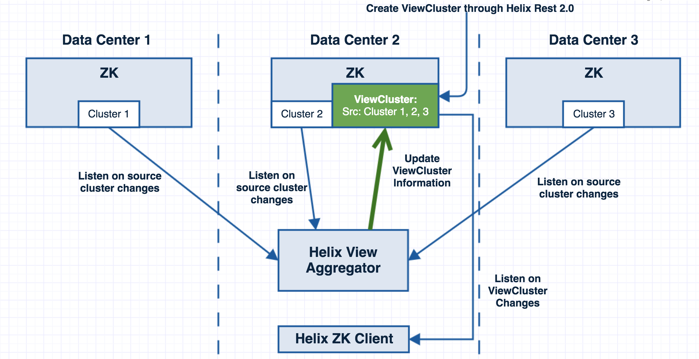
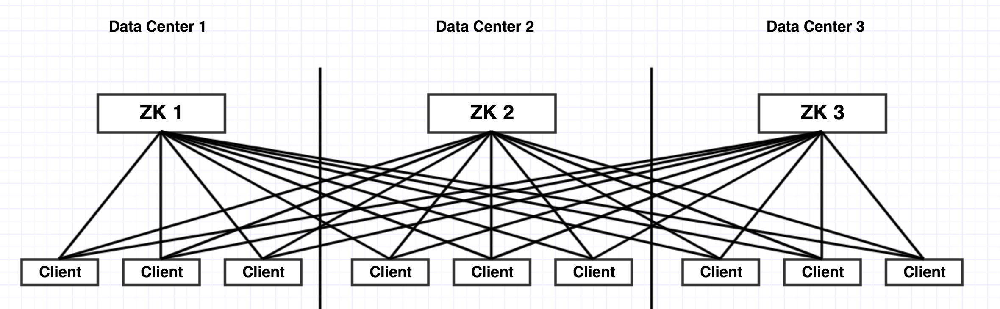
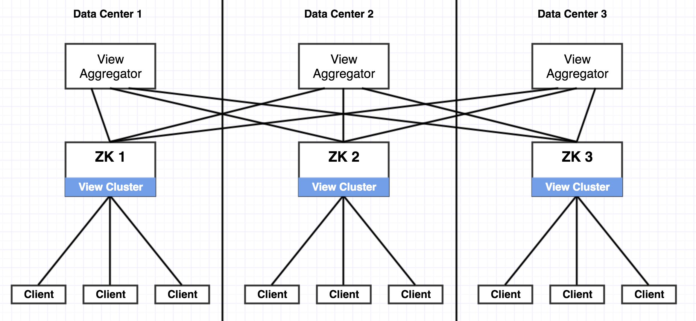
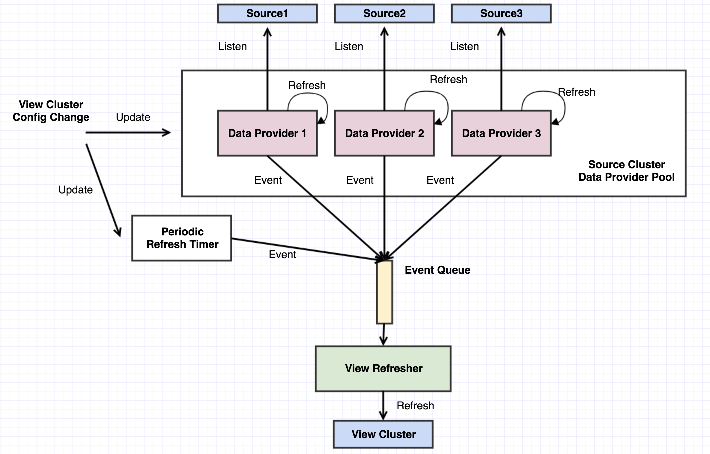
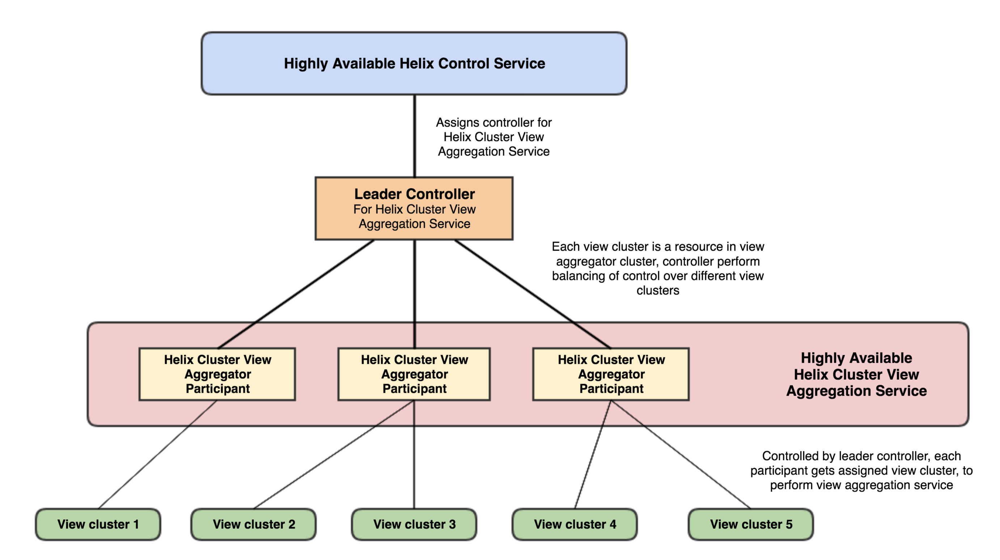

Aggregated Cluster View Design
==============================

## Introduction
Currently Helix organize information by cluster - clusters are autonomous entities that holds resource / node information.
In real practice, a helix client might need to access aggregated information of helix clusters from different data center regions for management or coordination purpose.
This design proposes a service in Helix ecosystem for clients to retrieve cross-datacenter information in a more efficient way. 


## Problem Statement
We identified a couple of use cases for accessing cross datacenter information. [Ambry](https://github.com/linkedin/ambry) is one of them.
For Ambry, it is commonly deployed across data centers, and each Ambry cluster in each data center will replicate each other for HA purpose.
Ambry uses Helix spectator in both their router (for retrying get requests remotely if failed locally) and storage node (for data replication purpose).
Given the amount of clients that need global information, it would be more cost-effective for them if aggregated information are provided locally. 


Here is a simplified example: some service has Helix cluster "MyDBCluster" in 3 data centers respectively, and each cluster has a resource named "MyDB".
To federate this "MyDBCluster", current usage is to have each federation client (usually Helix spectator) to connect to metadata store endpoints in all fabrics to retrieve information and aggregate them locally.
Such usge has the following drawbacks:

* As there are a lot of clients in each DC that need cross-dc information, there are a lot of expensive cross-dc traffics
* Every client needs to know information about metadata stores in all fabrics which
  * Increases operational cost when these information changes
  * Increases security concern by allowing cross data center traffic

To solve the problem, we have the following requirements:
* Clients should still be able to GET/WATCH aggregated information from 1 or more metadata stores (likely but not necessarily from different data centers)
* Cross DC traffic should be minimized
* Reduce amount of information about data center that a client needs
* Agility of information aggregation can be configured
* Currently, it's good enough to have only LiveInstance, InstanceConfig, and ExternalView aggregated


## Proposed Design

To provide aggregated cluster view, the solution I'm proposing is to add a special type of cluster, i.e. **View Cluster**.
View cluster leverages current Helix semantics to store aggregated information of various **Source Clusters**.
There will be another micro service (Helix View Aggregator) running, fetching information from clusters (likely from other data centers) to be aggregated, and store then to the view cluster.
If various clients running in a specific data center want to access aggregated information, they can just consume information from a view cluster local to them.

### Terminologies
* **Aggregated Cluster View**:  a read-only aggregated view of information from multiple Helix clusters. 
* **View Cluster**:  A new type of Helix cluster, which is different from regular Helix cluster (physical cluster) in that it provides the read-only **Aggregated Cluster View**.
* **Physical Cluster**: an actual Helix cluster that has participant, controller, etc.
  * All current Helix clusters, including super cluster are Physical Clusters
* **Source Physical Cluster (a.k.a Source Cluster)**: Actual Helix cluster to collect information from.
  * **Source Physical Cluster** has the source of truth information of **View Cluster**
  * In other words, source-of-truth data will be ***at least as fresh as*** data in **View Cluster**
* **View Aggregator**: a new type of micro-service in Helix ecosystem that generates **View Cluster** content

### View Aggregation Overview
Here is a big picture about how View Aggregator generates View Cluster, serving clients for cross data center information to client.


### Saving Cross-DC Traffic Using Aggregated Cluster View
Here is some calculation about how View Aggregation would solve the above mentioned problems.
As for a simple calculation using External View as example, lets assume:
* `m` clients per data center
* `n` data centers in total
* Size of external view a client needs from 1 data center is `b` Bytes
* `m` >> `n` > `1`

From the analysis blow, we can see that with view aggregator, cross-dc traffic can be reduced `m` times, and we are switching massive cross-dc traffic to local traffic

#### Traffic with Current Situation
Currently, to access information across different data center, a client will need to access all ZooKeepers directly:

* Total data needed by all clients: `(m * n * b) * n`
* Intra data center traffic: `(m * b) * n`
* Inter data center traffic (incoming + outgoing): `(m * (n-1) * b) * n`
 
#### Traffic with View Aggregation
Currently, to access information across different data center, a client will need to access all ZooKeepers directly:

* Total data needed by all clients: `(m * n * b) * n`
* Intra data center traffic:
  * For clients:`(m * n * b) * n`
  * For view aggregator: `b * n`
* Inter data center traffic (incoming + outgoing):
  * For clients: `0`
  * For view aggregator: `((n-1) * b) * n`

### Separate service VS zookeeper observers
Setting up [Zookeeper observer](https://zookeeper.apache.org/doc/r3.4.13/zookeeperObservers.html) is also an option to provide aggregated information.
Here is a comparison about pros and cons between using ZooKeeper observer and developing a separate service.

#### ZooKeeper Observer
Pros:
* Existing ZK component, officially supported by community, and
officially recommended for scaling read-only access
* Guarantee of event sequence consistency

Cons:
* All data in ZK will be propagated in real time no matter what, a waste
of cross DC traffic especially when Helix is sharing ZK with other
services, or when there is a few cluster need to be aggregated.
* New interface with aggregation logics need to be implemented and
upgraded at client side, which adds up configuration, upgrading and
performance overhead.
* Deployment overhead, as we need maintain deployments of observer in
each DC for different ZKs.

#### View Aggregator
Pros:
* Easy to control what clusters / what data inside each cluster to
aggregate, and at what granularity, with what semantics.
* No change on client side, as View cluster data model will follow
exactly same semantics as a normal Helix cluster, so all currently Helix
libraries can be used to access aggregated view.
* Reduce deployment overhead, as we only need to maintain 1 deployment
in each DC and choose from what ZKs to aggregate by configuring "source
cluster"

Cons:
* No guarantee of event sequence consistency: event happens in view
cluster does not reflect any ordering / timing of those in source cluster
(but we can enforce such sequence when needed by altering impl)
* Development overhead: if aggregation requirement gets more
complicated, its complexity will grow

From the above analysis, View Cluster and View Aggregator has their own values that native ZK Observer is not able to
provide, and makes it worth to develop such a service in Helix eco-system.


## Design Details
An independent module called `helix-view-aggregator` (just like `helix-rest`) will be created under Helix repo.
It uses building blocks in `helix-core` for its implementations. Necessary support will be added in `helix-core`.

### Configuration and Data Models
Generally speaking, view cluster will also be a Helix cluster, we add view cluster related information in cluster config.
Based on current business requirements, we will add the following information in cluster config about view cluster
* add a flag indicating that this is a view cluster
* add a config field for user to specify how often view cluster should be refreshed
  * to start with, it will be a refresh period in second, i.e. after x seconds, if there is any change in source cluster, we refresh view cluster
* add a list of source clusters to aggregate

A view cluster's cluster config ZNRecord would look like the following:
```json
{
  "id": "myCluster-VIEW",
  "simpleFields": {
    "VIEW_CLUSTER" : "true",
    "VIEW_CLUSTER_REFRESH_PERIOD": "20"
  },
  "listFields": {
    "VIEW_CLUSTER_SOURCES" : [
      "{\"name\": \"myCluster\", \"zkAddress\": \"zk-dc1:12913\", \"properties\": [\"EXTERNALVIEW\", \"INSTANCES\", \"LIVEINSTANCES\"]}",
      "{\"name\": \"myCluster\", \"zkAddress\": \"zk-dc2:12913\", \"properties\": [\"EXTERNALVIEW\", \"INSTANCES\", \"LIVEINSTANCES\"]}",
      "{\"name\": \"myCluster\", \"zkAddress\": \"zk-dc3:12913\", \"properties\": [\"EXTERNALVIEW\", \"INSTANCES\", \"LIVEINSTANCES\"]}"
    ]
  }
}
```


#### ViewClusterSourceConfig

*ViewClusterSourceConfig* contains information about a single source cluster, and will be stored as serialized JSON inside list field.
It contains 3 piece of information:
* source cluster name
* source cluster ZooKeeper address
* a list of properties to aggregate
```java
@JsonIgnoreProperties(ignoreUnknown = true)
public class ViewClusterSourceConfig {

  private final String _name;
  private final String _zkAddress;
  private List<PropertyType> _properties;

  @JsonCreator
  public ViewClusterSourceConfig(
      @JsonProperty("name") String name,
      @JsonProperty("zkAddress") String zkAddress,
      @JsonProperty("properties") List<PropertyType> properties
  ) {
    _name = name;
    _zkAddress = zkAddress;
    _properties = properties;
  }
  
  public void setProperties(List<PropertyType> properties) {
    _properties = properties;
  }
  
  public String getName() {
    return _name;
  }

  public String getZkAddress() {
    return _zkAddress;
  }

  public List<PropertyType> getProperties() {
    return _properties;
  }
}
```

#### Cluster config APIs
Cluster config will include the following ViewCluster related getters and setters
```java
public void setViewCluster();

public void setViewClusterSourceConfigs(List<ViewClusterSourceConfig> sourceConfigList);

public void setViewClusterRefreshPeriod(int refreshPeriod);

public boolean isViewCluster();

public List<ViewClusterSourceConfig> getViewClusterSourceConfigs();

public int getViewClusterRefreshPeriod();

```


### View Cluster Data Organization
We will use same data organization as a physical cluster to store view cluster information.
Therefore, accessing information from a view cluster will be exactly same as a physical cluster.
It is generally true that node from data center will have unique names, so we will use this as our assumption for organizing data.
*Note that if 2 source clusters share same instance, the behavior if aggregation will be UNKNOWN.*

#### LiveInstances and InstanceConfig

Therefore, for LiveInstances, view aggregator will pop all live instances from all source clusters to the `LIVEINSTANCES/` directory of view cluster.
For InstanceConfig, view aggregator will pop all instance configs from all source clusters to the `CONFIGS/PARTICIPANT/` directory of view cluster.
```text
LIVEINSTANCES/
  node1.datacenter1_12345/
  node2.datacenter1_23456/
  node1.datacenter2_12345/
  node1.datacenter3_12345/
```

```text
CONFIGS/
  PARTICIPANT/
	  node1.datacenter1_12345/
	  node2.datacenter1_23456/
	  node1.datacenter2_12345/
	  node1.datacenter3_12345/
```

#### ExternalView
Aggregated external view from different source clusters will be ***merged*** and stored in the `EXTERNALVIEW/` directory of view cluster.
For example, `myResource` exists in SourceCluster1, DataCenter1 and SourceCluster2, DataCenter2:
```text
# DataCenter1::cluster1/EXTERNALVIEW/myResource
{
  "id": "myResource",
  "listFields": {},
  "mapFields": {
    "myResource0": {
      "node1.datacenter1_11932": "SLAVE",
      "node2.datacenter1_11932": "MASTER",
      "node3.datacenter1_11932": "SLAVE"
    }
  }
}
 
# DataCenter2::cluster2/EXTERNALVIEW/myResource
{
  "id": "myResource",
  "listFields": {},
  "mapFields": {
    "myResource0": {
      "node1.datacenter2_11932": "SLAVE",
      "node2.datacenter2_11932": "MASTER",
      "node3.datacenter2_11932": "SLAVE",
      "node4.datacenter2_11932": "SLAVE",
      "node5.datacenter2_11932": "OFFLINE"
    }
  }
}
```
After aggregation, the external view of `myResource` will look like the follows:
```text
{
  "id": "myResource",
  "listFields": {},
  "mapFields": {
    "myResource0": {
      "node1.datacenter1_11932": "SLAVE",
      "node2.datacenter1_11932": "MASTER",
      "node3.datacenter1_11932": "SLAVE",
      "node1.datacenter2_11932": "SLAVE",
      "node2.datacenter2_11932": "MASTER",
      "node3.datacenter2_11932": "SLAVE",
      "node4.datacenter2_11932": "SLAVE",
      "node5.datacenter2_11932": "OFFLINE"
    }
  }
}

```
***Note***: we will not merge `simpleFields` for ExternalView as it is meaningless, what we need is just an aggregated view of states.


### Helix View Aggregator
Helix View Aggregator is a components that controls updates of a single view cluster.
It will contain the following components:
* **SourceClusterDataProvider**
  * Maintains a cache about source clusters
  * listens on source cluster change according to *ViewClusterSourceConfig* and updates its cache
  * Emit event to queue
* **PeriodicRefreshTimer**
  * Push refresh view cluster event to queue with frequency specified in view cluster config
* **ViewAggregator**
  * Takes event from SourceClusterDataProvider and PeriodicRefreshTimer, refresh view cluster when needed using view refresher
  * Listens on changes of view cluster config, and update SourceClusterDataProvider and PeriodicRefreshTimer
* **ViewRefresher**
  * Read source cluster data from SourceClusterDataProvider, generate view cluster content and update view cluster
 
The following graph illustrates high level components of a HelixViewAggregator:



## Deployment
### Standalone Deployment
We will provide a java CLI that spins up a single HelixViewAggregator that controls a single view cluster


### Distributed Deployment
In order to achieve high-availability for the service, we need to have a distributed deployment for the service.
In distributed deployment mode, View Aggregator will be implement as a leader-standby state model, so it can be running as a resource inside a Helix cluster.
Therefore we can have all the benefits of leveraging Helix controller to ensure high-availability and balanced load, when we want a dynamic management for view clusters.
The following diagram illustrates a distributed deployment of view aggregation service:



#### Distributed Deployment Procedure
Here is an proposed example of deploying Helix view aggregator service in a distributed fashion,
assuming we have a Helix controller super cluster (called `sharedSuperCluster`) already.

1. Create view aggregator cluster and activate it in super cluster
```bash
# Create view aggregator cluster
$ curl -XPUT helix.rest.dns:12954/admin/v2/namespaces/shared/clusters/view-aggregator-cluster
  
  
# Config view aggregator cluster
$ curl -XPOST -H "Content-Type: application/json" \
> helix.rest.dns:12954/admin/v2/namespaces/shared/clusters/view-aggregator-cluster/configs?command=update \
> -d '{"id": "view-aggregator-cluster", "simpleFields": {"allowParticipantAutoJoin": "true", "PERSIST_BEST_POSSIBLE_ASSIGNMENT": "true"}}'
  
  
# Activate view aggregator cluster
$ curl -XPOST "helix.rest.dns:12954/admin/v2/namespaces/shared/clusters/view-aggregator-cluster?command=activate&superCluster=sharedSuperCluster"
```

2. Deploy Helix participant that contains LeaderStandby state model implementation for Helix view aggregator.
These participants will be attached to the view-aggregator-cluster we created in step 1


3. Create view cluster
```bash
# Create view cluster
$ curl -XPUT helix.rest.dns:12954/admin/v2/namespaces/shared/clusters/myViewCluster
  
# Configure view cluster
$ curl -X POST -H "Content-Type: application/json" \
helix.rest.dns:12954/admin/v2/namespaces/shared/clusters/myViewCluster/configs?command=update \
-d '
{
  "id": "myViewCluster",
  "simpleFields" : {
    "VIEW_CLUSTER" : "true",
    "VIEW_CLUSTER_REFRESH_PERIOD": "20"
  },
  "listFields" : {
    "VIEW_CLUSTER_SOURCES" : [
      "{\"name\": \"myCluster\", \"zkAddress\": \"zk.datacenter1:12913\", \"properties\": [\"EXTERNALVIEW\", \"INSTANCES\", \"LIVEINSTANCES\"]}",
      "{\"name\": \"myCluster\", \"zkAddress\": \"zk.datacenter2:12913\", \"properties\": [\"EXTERNALVIEW\", \"INSTANCES\", \"LIVEINSTANCES\"]}",
      "{\"name\": \"myCluster\", \"zkAddress\": \"zk.datacenter3:12913\", \"properties\": [\"EXTERNALVIEW\", \"INSTANCES\", \"LIVEINSTANCES\"]}"
    ]
  }
 
}'
 
  
# Attach (activate) the view cluster to Helix's view-aggregator-cluster and there will be a
# Helix view aggregator assigned to generate view to myViewCluster
$ curl -XPOST "helix.rest.dns:12954/admin/v2/namespaces/shared/clusters/myViewCluster?command=activate&superCluster=view-aggregator-cluster"

```
