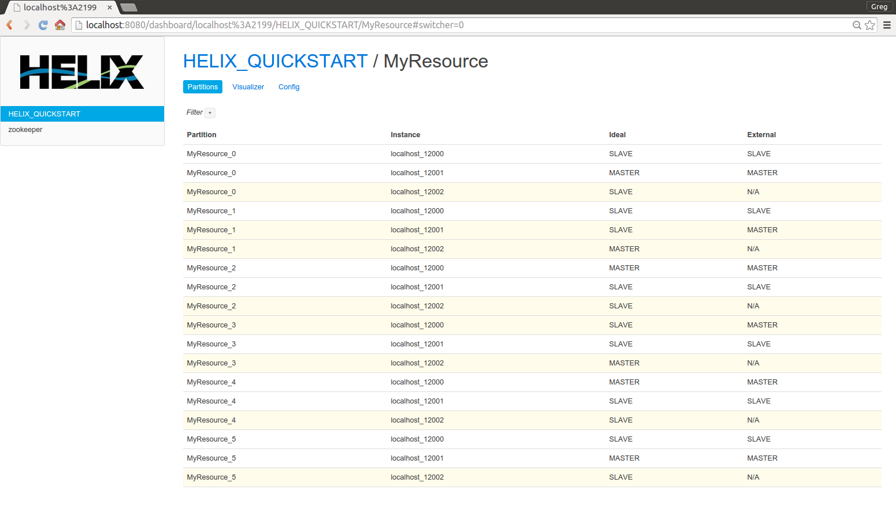
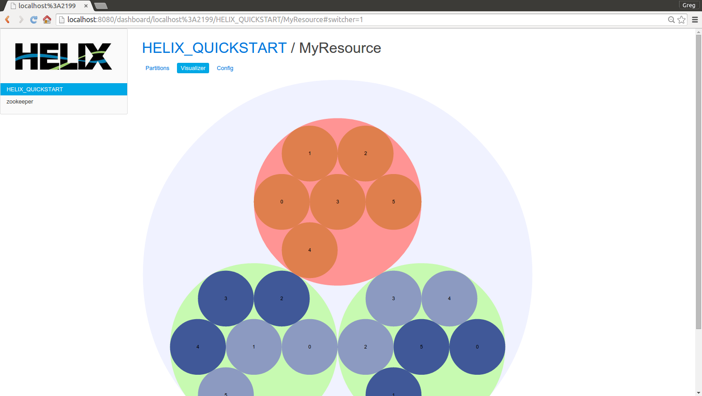
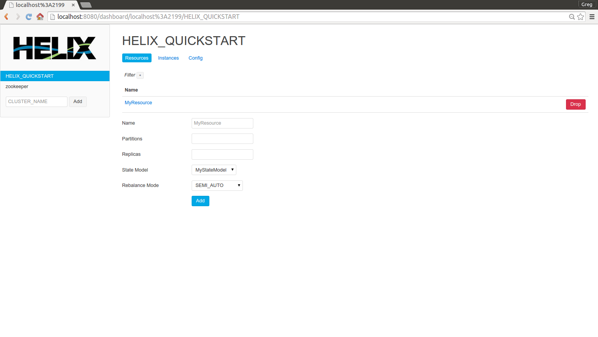
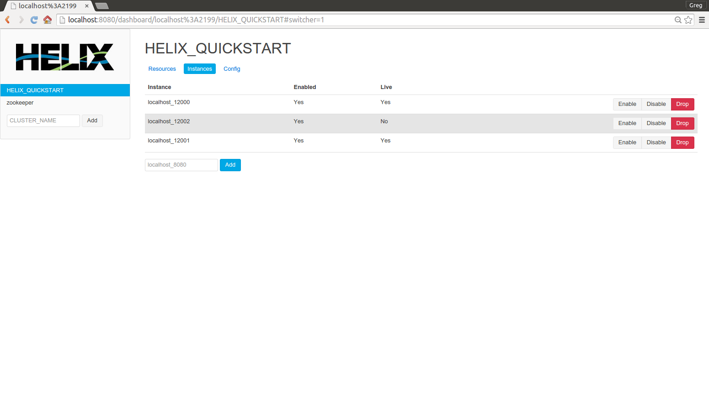

<!---
Licensed to the Apache Software Foundation (ASF) under one
or more contributor license agreements.  See the NOTICE file
distributed with this work for additional information
regarding copyright ownership.  The ASF licenses this file
to you under the Apache License, Version 2.0 (the
"License"); you may not use this file except in compliance
with the License.  You may obtain a copy of the License at

  http://www.apache.org/licenses/LICENSE-2.0

Unless required by applicable law or agreed to in writing,
software distributed under the License is distributed on an
"AS IS" BASIS, WITHOUT WARRANTIES OR CONDITIONS OF ANY
KIND, either express or implied.  See the License for the
specific language governing permissions and limitations
under the License.
-->

# helix-ui

After building the project from the root directory (i.e. `./build`), find the
`helix-ui-${version}.jar` artifact in this module's `target` directory.

To run the UI server in read-only mode with no configuration, execute the
following commands:

```
java -jar helix-ui-${version}.jar server
```

Navigate to `http://localhost:8080/dashboard` to get started. At this page,
enter a ZooKeeper address, e.g. "localhost:2181,localhost:2182" or
"some-machine:2181/chroot", to get started.

The following shows using the dashboard to view the end state of MyResource in
the Quick Start, in tabular form:



And using visualization:



## Admin

In order to run the server in admin mode, set `adminMode: true` in the
application configuration. 

To restrict the ZooKeeper machines that the UI will try to connect to, use the
`zkAddresses` configuration parameter. The application will never try to
connect using a ZooKeeper connection string that contains machines not in that
list.

When the server is configured to run in admin mode, several buttons to perform
actions like add / drop resource, add / enable / disable / drop instance, etc.
are rendered on the UI at appropriate locations.

The following shows the admin resource view:



And the following shows the admin instance view:



## Configuration

For example, the following configuration runs the server in admin mode, only
connecting to "localhost:2181", on ports 60000 for normal application traffic,
and 60001 for admin actions:

```
adminMode: true

zkAddresses:
  - "localhost:2181"

server:
    applicationConnectors:
        - type: http
          port: 60000
    adminConnectors:
        - type: http
          port: 60001
```

If this configuration exists in a file named `/tmp/my-config.yml`, one would
run the server in the following way:

```
java -jar helix-ui-${version}.jar server /tmp/my-config.yml
```

For more details on configuration, see [Dropwizard Configuration
Reference](https://dropwizard.github.io/dropwizard/manual/configuration.html)
